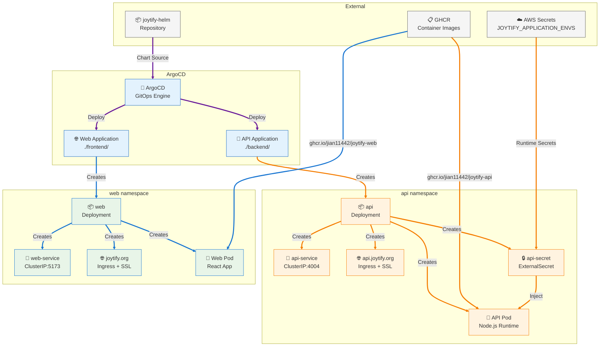

#  Joytify Helm Charts

> Kubernetes application deployments for Joytify frontend and backend services

## 📋 Project Documentation

- **⚙️ [GitHub Workflows](https://github.com/JIAN11442/joytify-app/tree/main/.github)** - CI/CD for testing, building images, and updating Helm chart values
- **📦 [Helm Charts](https://github.com/JIAN11442/joytify-helm)** - Frontend/backend deployments with ingress, services, and configurations _(You are here)_
- **🚀 [Kubernetes Infrastructure](https://github.com/JIAN11442/joytify-infra)** - Platform services required for deployment (ArgoCD, ingress, cert-manager, etc.)

---

## 📋 Table of Contents

- [🎯 Overview](#-overview)
- [🏗️ Architecture](#️-architecture)
- [📁 Chart Structure](#-chart-structure)

---

## 🎯 Overview

This repository contains Helm charts for deploying Joytify applications to Kubernetes. These charts are **automatically managed** through GitOps workflows:

- **GitHub Actions** update chart values when new images are built
- **ArgoCD** monitors this repository and deploys changes to Kubernetes
- **No manual deployment required** - everything is automated

**What this repository contains:**

- Frontend (React) application Helm chart
- Backend (Node.js API) application Helm chart
- Environment-specific value configurations
- Kubernetes manifests for services, ingress, and deployments

## 🏗️ Architecture



The architecture diagram above shows the complete Helm chart deployment flow:

### **Backend Chart Flow (Orange)**

- **API Application**: ArgoCD deploys the `./backend/` chart to create all backend resources
- **Resource Creation**: Deployment, Service, Ingress, and ExternalSecret resources in `api` namespace
- **Container Management**: Deployment spawns 2 replicas of API pods with Node.js runtime
- **Runtime Secrets**: External Secrets Operator injects AWS secrets at container startup

### **Frontend Chart Flow (Blue)**

- **Web Application**: ArgoCD deploys the `./frontend/` chart to create all frontend resources
- **Resource Creation**: Deployment, Service, and Ingress resources in `web` namespace
- **Container Management**: Deployment spawns 2 replicas of Web pods with React application
- **Build-time Secrets**: Environment variables baked into container image during build

### **GitOps Automation (Purple)**

- **Repository Monitoring**: ArgoCD polls this repository every 3 minutes for changes
- **Automatic Sync**: Chart changes trigger immediate deployment to Kubernetes cluster
- **Configuration Management**: GitHub Actions update chart values when infrastructure or images change

## 📁 Chart Structure

### Backend Chart (`./backend/`)

```
backend/
├── Chart.yaml
├── values.yaml
└── templates/
    ├── deployment.yaml
    ├── service.yaml
    ├── ingress.yaml
    └── external-secrets.yaml
```

**Deployment**: Defines the API application deployment with Node.js runtime containers

- **Namespace**: Deployed to `api` namespace _(sync with joytify-infra api namespace)_
- **Replicas**: 2 with rolling update strategy (maxUnavailable=1, maxSurge=1)
- **Environment**: References External Secret for runtime injection + static config from values.yaml
- **Service Reference**: Uses `api-service` name _(sync with joytify-infra API_SERVICE_NAME)_

**Service**: Exposes the API deployment internally within the Kubernetes cluster

- **Type**: ClusterIP for internal cluster communication
- **Port**: 4004 _(sync with joytify-infra API_SERVICE_PORT)_
- **Target**: Routes traffic to API deployment pods

**Ingress**: Configures external access routing and SSL termination for the API

- **Domain**: `api.joytify.org` _(sync with joytify-infra API_DOMAIN)_
- **SSL**: Automatic certificate management via cert-manager
- **Backend**: Routes external traffic to api-service

**External Secret**: Manages runtime secret injection from AWS Secrets Manager into API pods

- **Source**: AWS Secrets Manager key `JOYTIFY_APPLICATION_ENVS`
- **Authentication**: Uses `aws-credentials` secret _(sync with joytify-infra AWS_CREDENTIALS_NAME)_
- **Image Pull**: Uses `ghcr-secret` _(sync with joytify-infra GHCR_SECRET_NAME)_
- **Target**: Creates `api-secret` with runtime environment variables

**Values**: Contains chart configuration and deployment parameters _(automatically updated by GitHub Actions)_

- **image.tag & digest**: Container image version and security verification
- **imagePullSecrets.name**: GHCR authentication for private registry access
- **container.port**: API container port configuration
- **service**: Service name, port, and targetPort for cluster communication
- **awsCredentials**: AWS credentials name and key mappings for External Secrets Operator
- **secretStore.aws.region**: AWS region for Secrets Manager access
- **externalSecret.dataFrom.extract.key**: Source key for runtime secret injection
- **ingress**: Domain and certificate issuer for external HTTPS access
- **envs**: Static environment variables (ORIGIN_APP, API_PORT, OFFICIAL_EMAIL, TEST_EMAIL)

**Environment Variables:**

- **Runtime**: Sensitive secrets injected via External Secrets Operator
- **Static**: `ORIGIN_APP`, `API_PORT`, `OFFICIAL_EMAIL` from values.yaml

### Frontend Chart (`./frontend/`)

```
frontend/
├── Chart.yaml
├── values.yaml
└── templates/
    ├── deployment.yaml
    ├── service.yaml
    └── ingress.yaml
```

**Deployment**: Defines the web application deployment with React frontend containers

- **Namespace**: Deployed to `web` namespace _(sync with joytify-infra web namespace)_
- **Replicas**: 2 with rolling update strategy (maxUnavailable=1, maxSurge=1)
- **Environment**: All variables baked into image during build
- **Service Reference**: Uses `web-service` name _(sync with joytify-infra WEB_SERVICE_NAME)_
- **Image Pull**: Uses `ghcr-secret` _(sync with joytify-infra GHCR_SECRET_NAME)_

**Service**: Exposes the web deployment internally within the Kubernetes cluster

- **Type**: ClusterIP for internal cluster communication
- **Port**: 5173 _(sync with joytify-infra WEB_SERVICE_PORT)_
- **Target**: Routes traffic to web deployment pods

**Ingress**: Configures external access routing and SSL termination for the web application

- **Domain**: `joytify.org` _(sync with joytify-infra WEB_DOMAIN)_
- **SSL**: Automatic certificate management via cert-manager
- **Backend**: Routes external traffic to web-service

**Values**: Contains chart configuration and deployment parameters _(automatically updated by GitHub Actions)_

- **image.tag & digest**: Container image version and security verification
- **imagePullSecrets.name**: GHCR authentication for private registry access
- **container.port**: Web container port configuration
- **service**: Service name, port, and targetPort for cluster communication
- **ingress**: Domain and certificate issuer for external HTTPS access

**Environment Variables:**

- **Build-time**: All variables injected during GitHub Actions image build
- **No Runtime Secrets**: Uses only public configuration, no External Secrets Operator
